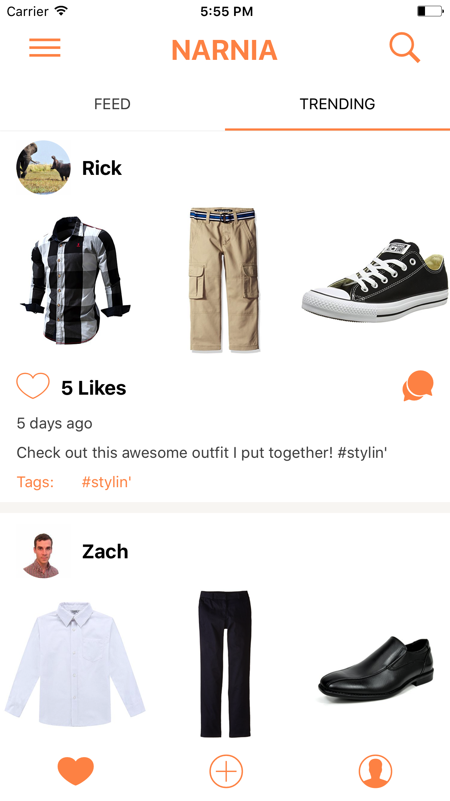
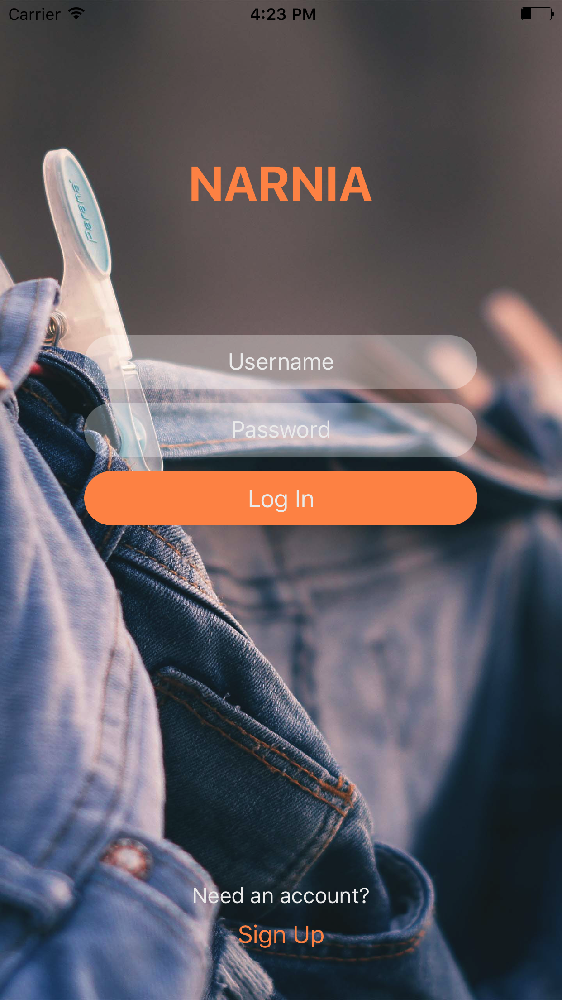
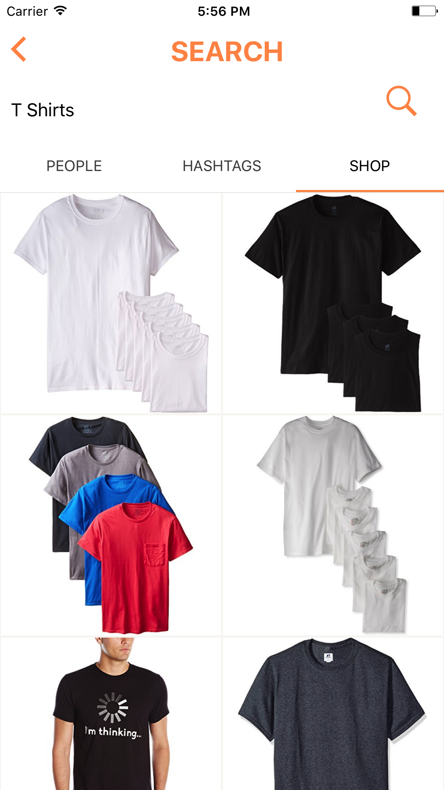

# Project Narnia

  
  
  
  
  

## Synopsis

Project Narnia is a social media platform to encourage and assist in the creation of user generated content for the fashion space. Having basic social platform functionality (likes, shares, comments, etc) allows users to easily share their outfits and get feedback on their styling. With functionality like personal wardrobes users are able to upload their personal wardrobe into the application and design outfits to wear without having to pull anything out of their closets. Tapping into Amazon's Product Advertising API makes adding clothing easy and seamless. 

## Motivation

The motivation for Project Narnia is vast and diverse. One influencing factor is that the fashion industry seems beyond the reach of most in its current state. From stylist to designer, there is a large barrier to entry. One goal is to break that and allow anyone to be a stylist and designer with ease; all from the comfort of their couch. Another influencer is that it is rather difficult to buy clothes effectively. It is challenging to know what they already have, what they could use, what would go well with items they already own, and what would actually fit. Project Narnia aims to solve this.  

## Installation

- Install all prerequisites: [node](https://github.com/nodejs/node), [npm](https://github.com/npm/npm), [xcode](https://developer.apple.com/xcode/), [react-native-cli](https://facebook.github.io/react-native/docs/getting-started.html)
- In the terminal run `npm install && cd NarniaNative && npm install` in the main Narnia directory. (be patient it may take a minute)
- Start up MySQL server with `mysql.server start`
- Create and populate the database by having excuting `mysql < schema.sql` in the DB directory
- While in the Narnia directory, launch node server with `npm start`
- While in the NarniaNative directory, boot up the simulator with `react-native run-ios`

## API Reference

The APIs in use are: 
 - [Amazon Product Advertising API](https://affiliate-program.amazon.com/gp/advertising/api/detail/main.html)
 - [Google Cloud Storage](https://cloud.google.com/storage/)

## Tests

Run `npm test` within the Narnia directory.

## Contributors

Read the `_CONTRIBUTING.md` document in the repo. If further direction is needed, talk to your engineering lead. 

## License
   
This a private repo. If you made it here, you are on the team or a very resourceful hacker. Congratulations! Taking any code and claiming it as yours is tantamount to STEALING.